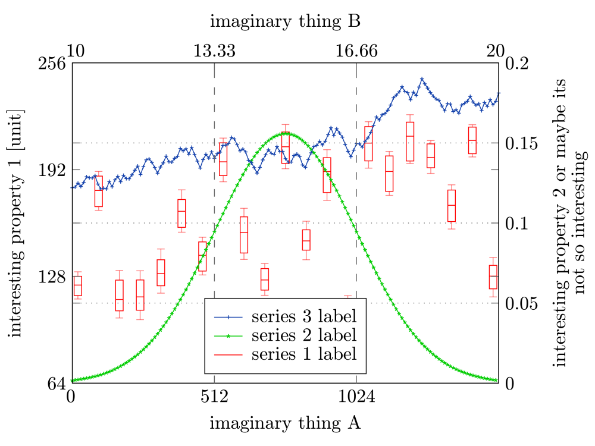

# luaplot
Luaplot is a framework to visualize data and export it to pdf files.
It offers various types of plots, like boxplots, normal and stacked line plots, histograms.
 
# Documentation

TODO

# Examples

One simple example showing two normal lineplots, and a boxplot, with 2 axes and 2 yaxis, a legend is found in [examples](./examples/)
The result is similar to this (but not the same, as the graphs represent random data), you also have to change the font or get a copy of the TTF version of `cmr10`. If no font is specified it uses the base14 built-in pdf font `Helvetica`.

 
# Dependencies
* [LuaHPDF](https://github.com/jung-kurt/luahpdf), which depends on [libharu](https://github.com/libharu/libharu)
